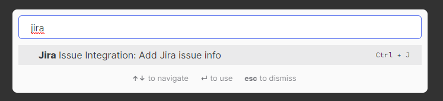

# Obsidian.md Jira Server integration

This is an Obsidian plugin that allows you to populate a template with fields from a Jira issue.



## Why

I tend to keep local notes for every ticket I work on - this plugin lets me populate the file initially without having to copy-paste from the Jira UI.

## How

Right now, this plugin is pretty limited in scope and works for my use case:

- Create a file whose name matches a Jira ticket number (minus the `.md` extension)
- Run the `Add Jira issue info` command
    - I have a hotkey assigned for this
- The template configured in plugin settings will be populated with the contents of the issue

A basic template might look like this (note that custom fields are unique to the Jira Server instance):

```
# [<%= it.fields.summary %>](<%= it.link %>)

### Acceptance Criteria

<%= it.fields.customfield_10131 %>

### Description

<%= it.fields.description %>
```

`it.link` is a special template field that constructs a link to the UI.

## Installation

Just download the code, unzip it and stick it in your plugins folder. 
You'll then need to enable it in the community plugins tab.

Only do this after you've reviewed the code - **don't give unfamiliar github plugins your Jira credentials.**

## Settings

The settings panel for the plugin takes 3 inputs:

- Your Jira server hostname
- A Jira server personal access token
- Path to a template file which will be populated with issue information
